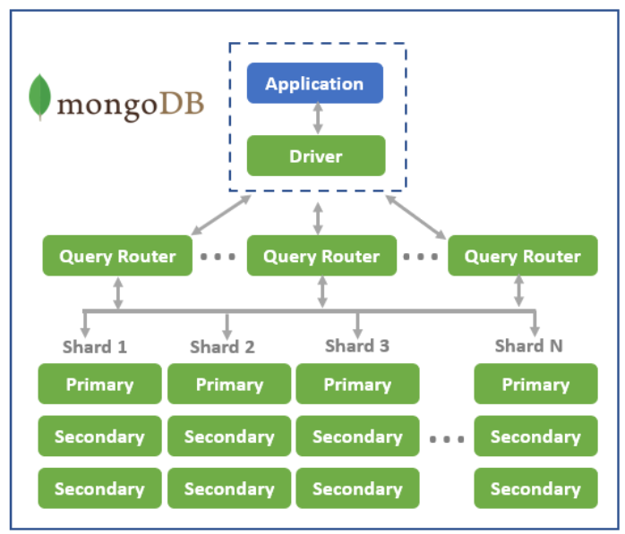

# MongoDB

#### What is MongoDB

MongoDB is a document-oriented NoSQL database used for high volume data storage. Instead of using tables and rows as in the traditional relational databases, MongoDB makes use of collections and documents. Documents consist of key-value pairs which are the basic unit of data in MongoDB. Collections contain sets of documents and function which is the equivalent of relational database tables. MongoDB is a database which came into light around the mid-2000s.

#### Differences between SQL and NoSQL

NoSQL is a non-relational database, meaning it allows different structures than a SQL database (not rows and columns) and more flexibility to use a format that best fits the data. The term “NoSQL” was not coined until the early 2000s. It doesn’t mean the systems don’t use SQL, as NoSQL databases do sometimes support some SQL commands. More accurately, “NoSQL” is sometimes defined as “not only SQL.”

SQL and NoSQL differ in whether they are relational (SQL) or non-relational (NoSQL), whether their schemas are predefined or dynamic, how they scale, the type of data they include and whether they are more fit for multi-row transactions or unstructured data.

#### How MongoDB came about and why is it so popular?

"MongoDB was born out of our frustration using tabular databases in large, complex production deployments. We set out to build a database that we would want to use, so that whenever developers wanted to build an application, they could focus on the application, not on working around the database."

MongoDB has many benefits compared to its competitor databases and these consist of: 

- Flexibility and ease of use.

- All documents are stored in JSON, aligns with the building of RESTful API's.

- The rise of Javascript development is also perfectlly aligned with the use of JSON files.

#### MongoDB Architecture

The sharding property of MongoDB enables it to perform fast and in an efficient manner in the distributed functions. This is also possible since it supports horizontal scaling of data.

#### Seeding

Database seeding is the initial seeding of a database with data. Seeding a database is a process in which an initial set of data is provided to a database when it is being installed.

The main purpose of Mongo Seeding is preparing ready-to-go development environment for your application. However, the tool will be a good choice for testing database queries, automatically or manually, as well as setting initial state for your application.

#### MongoDB Default port 

- `27017` - The default port for Mongod and Mongos instances.

